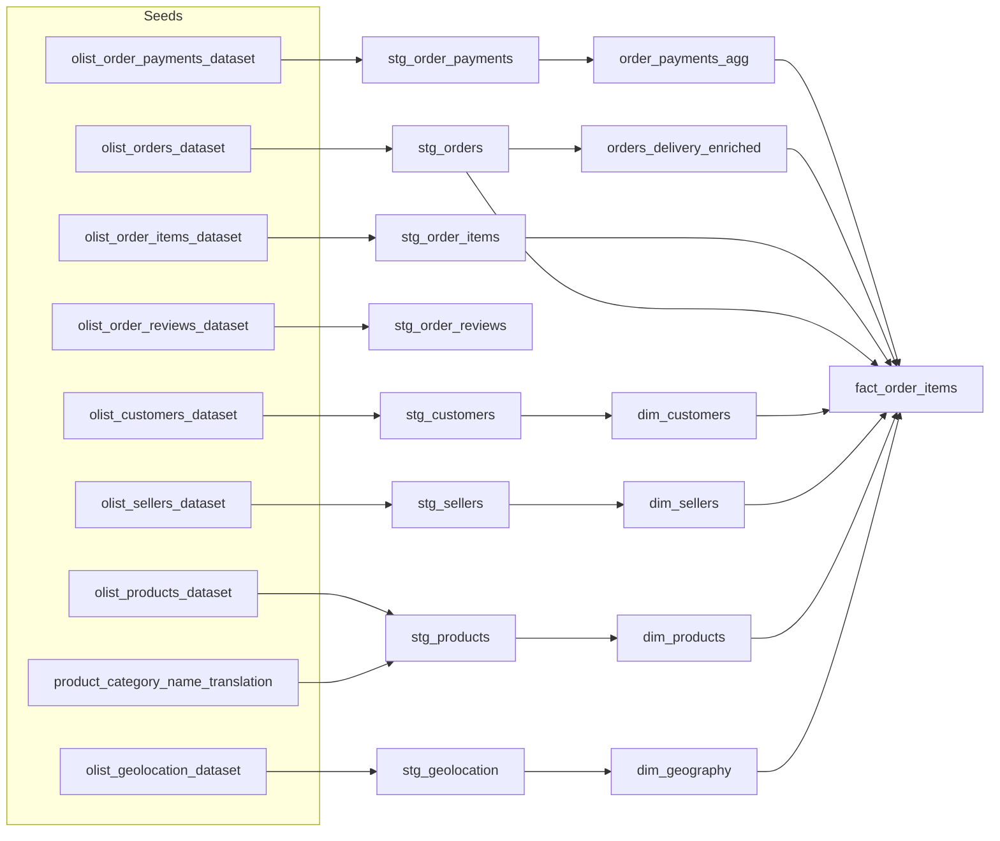

# Olist (Brazilian E-commerce) · dbt Core Analytics Project

This project builds a clean star schema over the Kaggle Olist dataset using dbt Core (v1.10+). It ships with:

- **Seeds**: load CSVs into your DuckDB file or warehouse
- **Staging**: type casting, naming, basic cleaning
- **Intermediate**: payment aggregation & delivery KPIs
- **Marts**: star schema (dimensions + fact)
- **Snapshots**: track slowly changing customer and seller details
- **Tests**: generic and package tests
- **Docs**: auto-generated catalog & lineage graph

## Quickstart (DuckDB)
1. Install dependencies
   ```bash
   python -m pip install "dbt-core==1.10.*" dbt-duckdb
   ```
2. Ensure the Kaggle CSVs live in `./seeds` (they are committed for you).
3. Configure your profile:
   - Copy `profiles.example.yml` to `~/.dbt/profiles.yml` (or point `DBT_PROFILES_DIR` to this project) and keep the `duckdb` target.
4. Build the project
   ```bash
   dbt deps
   dbt seed
   dbt build
   dbt docs generate
   ```

## Postgres Variant
1. Install adapter
   ```bash
   python -m pip install "dbt-core==1.10.*" "dbt-postgres==1.10.*"
   ```
2. In `profiles.yml`, switch to the `postgres` target and ensure your database has a schema (e.g. `raw` + `analytics`).
3. Either keep using `dbt seed` or load the CSVs into your `raw` schema and update staging models to read from `source('raw', ...)`.

## Default Star Schema
- **Fact**: `fact_order_items` (grain: order + order item)
- **Dimensions**: `dim_customers`, `dim_sellers`, `dim_products`, `dim_geography`, `dim_date`
- **Intermediate**: `order_payments_agg`, `orders_delivery_enriched`

## Key Metrics
- Revenue = price + freight
- Delivery time = delivered date − purchase date
- Delivery delay = delivered date − estimated delivery
- Review NPS-style scoring from `review_score`

## Useful Commands
```bash
dbt debug                 # Validate profile/connection
dbt build --select stg_+  # Build staging layer only
dbt test --select tag:mart
dbt snapshot              # Refresh snapshots
dbt docs serve            # Explore docs locally
```

## Project Layout
```
olist_dbt/
├─ dbt_project.yml
├─ packages.yml
├─ profiles.example.yml
├─ macros/
├─ seeds/
├─ models/
│  ├─ staging/
│  ├─ intermediate/
│  └─ marts/
└─ snapshots/
```

## Lineage Overview


Feel free to extend the project with incremental models, custom metrics, or warehouse-specific grants.
